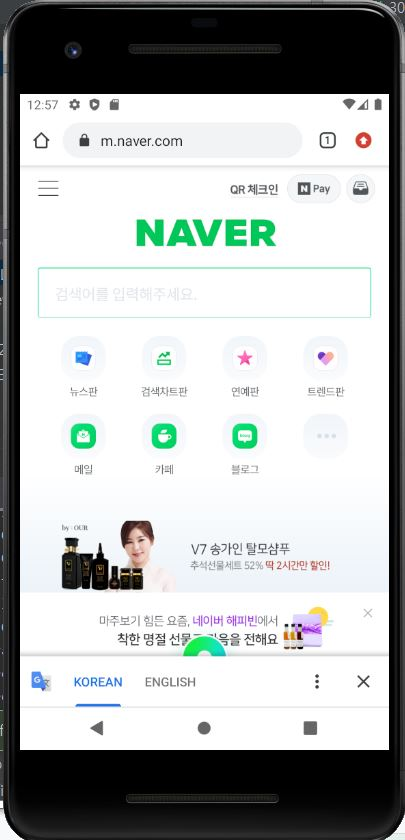

# 19173017최세림

## 2주차과제
</img>

## 3 주차과제
</img>
</img>

## 4 주차과제
- 호텔 예약 하는 앱
  : 회원가입을 간단하게 한다. (이름, 생년월일, 핸드폰 번호인증)
  : 호텔을 예약할 때 날짜와 묵을 기간, 가격대, 위치를 정하면 예약가능한 호텔들을 다 나열해준다.
  : 호텔을 예약하기 전 궁금한 것들이 생기면 QnA를 눌러 물어보고 싶은 것을 물어본다.
  : 호텔을 평가하는 리뷰공간을 잘 활용하여 홍보한다.
  : 호텔의 사진을 잘 활용하여 호텔 안의 공간을 보여준다.
  : 호텔에 묵을 때 불편한 점이나 필요한 것이 생길 때 프론트로 오지 않고 앱으로 바로바로 요청한다.
  : 호텔 키 대신 앱으로 들어가 문을 열 수 있게 해준다.
